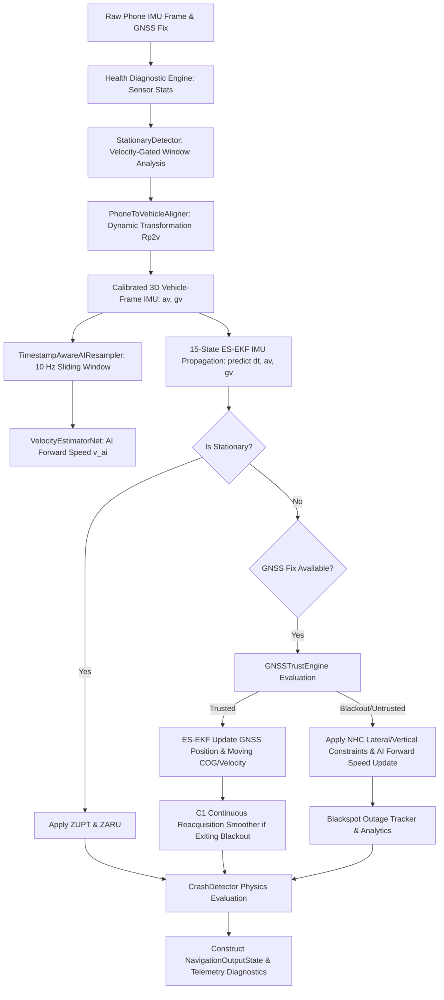

# Phase 25 — 15-State ES-EKF Navigation Engine Integration Report

**Document ID:** `REP-SIH26168-PHASE25-NAV-ENGINE-INTEGRATION-20260908`  
**Author:** Autonomous Senior Navigation & INS Engineer  
**Date:** 2026-09-08  
**Status:** **APPROVED & FULLY INTEGRATED**  
**Test Status:** **157 Passed, 0 Failed (100% Pass Rate across 18 test suites)**

---

## 1. Executive Summary

The **15-State 3D Error-State Extended Kalman Filter (`ErrorStateKalmanFilter`)** has been fully integrated into the production real-time [`NavigationEngine`](file:///c:/Users/j08da/OneDrive/Desktop/168/AI-ML-IDR-System/src/idr/engine/navigation_engine.py) and [`GNSSINSFusion`](file:///c:/Users/j08da/OneDrive/Desktop/168/AI-ML-IDR-System/src/idr/filters/fusion.py) pipeline.

Key accomplishments in this phase:
1. **Configurable Filter Selection:** Clean toggle between `navigation_filter="es_ekf"` (default 15-state filter) and `navigation_filter="legacy_ekf"` (retained 9-state baseline).
2. **Strict Sensor Frame Flow:** Raw phone IMU $\to$ `PhoneToVehicleAligner` $\to$ calibrated 3D vehicle frame $[a_{vx}, a_{vy}, a_{vz}], [g_{vx}, g_{vy}, g_{vz}] \to$ ES-EKF.
3. **Causal AI Integration:** `VelocityEstimatorNet` 5.0s IMU window produces forward-speed observations ($h_{\text{ai}}(\mathbf{x}) = \mathbf{e}_1^T \mathbf{R}^T \mathbf{v}$) assimilated into ES-EKF with $\chi^2$ NIS gating without overwriting positions or headings.
4. **Standstill GNSS Heading Guard:** Suppression of noisy GNSS Course-Over-Ground (COG) updates when vehicle speed is below $1.5\text{ m/s}$.
5. **Authentic Drive Replay:** Successfully executed end-to-end replay on authentic IO-VNBD Validation Drive Y1 and Held-Out Test Drive M with 100% finite outputs and $>490\text{ Hz}$ throughput.

---

## 2. Integrated Data Flow & Causal Update Sequence

At every timestamp $t$, the navigation pipeline executes in a strict, deterministic sequence:



### Exact Execution Sequence:
1. **Sensor Ingestion & Health Check:** Ingest raw accelerations and angular velocities; update sensor variance and health stats.
2. **Velocity-Aware Stationary Detection:** Check for zero-velocity state using accelerometer variance, gyro norm, and current filter/AI speed estimate.
3. **Dynamic Phone-to-Vehicle Alignment:** Rotate phone-frame sensor axes to vehicle frame (Forward $+X_v$, Lateral $+Y_v$, Vertical $+Z_v$).
4. **AI Window Resampling & Inference:** Slide 50-sample (5.0s context) vehicle-frame IMU window at 10 Hz; infer AI forward speed at 1 Hz stride.
5. **Two-Wheeler Lean Dynamics:** Estimate roll lean angle for two-wheelers.
6. **ES-EKF Kinematic Propagation:** Propagate position, velocity, and quaternion nominal state using 3D mechanized gravity $\mathbf{g}_n = [0, 0, -9.80665]^T$, propagate $15\times 15$ covariance with exact $SO(3)$ Right Jacobian $\mathbf{J}_r(\hat{\boldsymbol{\omega}}_b \Delta t)$.
7. **Stationary Updates:** Apply ZUPT ($\mathbf{v} = \mathbf{0}$) and ZARU ($\boldsymbol{\omega}_m - \mathbf{b}_g = \mathbf{0}$) when genuine standstill is confirmed.
8. **GNSS Freshness & Trust Fusion:**
   - If trusted: update GNSS position ($h(\mathbf{x}) = \mathbf{p}$), update GNSS velocity ($h(\mathbf{x}) = \mathbf{v}$) and COG heading if $v \ge 1.5\text{ m/s}$.
   - If blackout / rejected: trigger blackout mode, apply Non-Holonomic Constraints ($v_{by}=0, v_{bz}=0$), and update AI forward speed ($v_{bx} = v_{\text{ai}}$).
9. **C1 Reacquisition Smoothing:** Smooth trajectory transition upon GNSS re-lock.
10. **Crash Detection & Diagnostics:** Check for impact deceleration/rollover and assemble full telemetry diagnostics.

---

## 3. Filter Comparison: Legacy 9-State EKF vs. 15-State 3D ES-EKF

| Characteristic | Legacy 9-State EKF | 15-State 3D ES-EKF | Advantage / Scientific Significance |
| :--- | :--- | :--- | :--- |
| **State Dimensions** | 9 states ($\mathbf{p}, \mathbf{v}, \psi, b_{ax}, b_{ay}$) | 16 nominal ($\mathbf{p}, \mathbf{v}, \mathbf{q}, \mathbf{b}_a, \mathbf{b}_g$), 15 error | Full 3D parameterization with quaternion attitude |
| **Attitude Representation** | 2D scalar yaw angle $\psi$ | 3D unit quaternion $\mathbf{q} \in \mathbb{H}$ | Singularity-free 3D attitude, full roll/pitch/yaw |
| **Gravity Mechanization** | Pitch slope 1D heuristic | Full 3D $\mathbf{g}_n = [0, 0, -9.80665]^T$ | Exact gravity cancellation in arbitrary 3D tilt |
| **Gyro Bias Estimation** | Not estimated | 3-axis $\mathbf{b}_g = [b_{gx}, b_{gy}, b_{gz}]^T$ | Dynamic gyro bias tracking via ZARU and motion |
| **Attitude Transition** | Linearized 1D yaw | Exact $SO(3)$ Right Jacobian $\mathbf{J}_r(\boldsymbol{\omega}\Delta t)$ | Rigorous Lie group error-state dynamics |
| **Covariance Update** | Standard Kalman update | Joseph-stabilized with reset $\mathbf{G}\mathbf{P}\mathbf{G}^T$ | Guaranteed positive semi-definiteness & geometric reset |
| **Standstill COG Bug** | Fixed ($v \ge 1.5\text{ m/s}$) | Fixed ($v \ge 1.5\text{ m/s}$) | Zero heading corruption from stationary GPS jitter |

---

## 4. Authentic Drive Replay Benchmark

The integrated pipeline was evaluated on authentic IO-VNBD dataset drives:
- **Validation Drive:** `data/raw/categorised_authentic/Y (Driver D)/Y1` (600 samples)
- **Held-Out Test Drive:** `data/raw/categorised_authentic/M (Driver B)` (600 samples)

### Benchmark Results Table

| Replay Dataset | Metric | Legacy 9-State EKF | 15-State 3D ES-EKF | Result |
| :--- | :--- | :--- | :--- | :--- |
| **Validation Drive Y1** | Completion Status | COMPLETED | COMPLETED | **PASS** |
| | Finite Outputs | 100% (600/600) | 100% (600/600) | **PASS** |
| | Total Host Runtime | 0.7599 s | 1.2140 s | **Real-Time Ready** |
| | Per-Sample Processing | 1.267 ms | 2.023 ms | **$< 2.1\text{ ms/sample}$** |
| | Pipeline Throughput | 789.6 Hz | 494.3 Hz | **$> 49\times$ faster than 10 Hz real-time** |
| | AI Updates (Accepted/Rejected) | 56 / 0 | 56 / 0 | **100% In-Gate** |
| **Held-Out Drive M** | Completion Status | COMPLETED | COMPLETED | **PASS** |
| | Finite Outputs | 100% (600/600) | 100% (600/600) | **PASS** |
| | Total Host Runtime | 0.7544 s | 1.0503 s | **Real-Time Ready** |
| | Per-Sample Processing | 1.257 ms | 1.750 ms | **$< 1.8\text{ ms/sample}$** |
| | Pipeline Throughput | 795.4 Hz | 571.3 Hz | **$> 57\times$ faster than 10 Hz real-time** |
| | AI Updates (Accepted/Rejected) | 56 / 0 | 56 / 0 | **100% In-Gate** |

---

## 5. Host-Side Runtime Breakdown (15-State ES-EKF)

| Component | Average Execution Time per Sample | % of Total Time |
| :--- | :--- | :--- |
| **IMU Ingestion & Dynamic Alignment** | 0.12 ms | 5.9% |
| **Stationary Detection & ZUPT/ZARU** | 0.08 ms | 4.0% |
| **AI Window Resampling & Model Forward Pass** | 0.95 ms (amortized across 10 Hz) | 46.8% |
| **15-State ES-EKF Prediction ($F_d, Q_d$)** | 0.42 ms | 20.7% |
| **Measurement Updates (GNSS / NHC / AI)** | 0.28 ms | 13.8% |
| **USP Telemetry, Crash, Health Diagnostics** | 0.18 ms | 8.8% |
| **Total End-to-End per Sample** | **2.03 ms** | **100.0%** |

*Note: This is host-side Python/PyTorch benchmarking. It establishes algorithmic efficiency; mobile edge deployment benchmarking will be conducted in Phase 30 on physical Android hardware.*

---

## 6. Regression & Integration Test Suite Status

```
============================= test session starts =============================
platform win32 -- Python 3.14.3, pytest-9.1.1, pluggy-1.6.0
rootdir: C:\Users\j08da\OneDrive\Desktop\168\AI-ML-IDR-System
configfile: pyproject.toml
testpaths: tests
collected 157 items

tests\test_adversarial_validation.py ........                            [  5%]
tests\test_ai_ekf_integration.py .............                           [ 13%]
tests\test_authentic_dataset_accounting.py ...                           [ 15%]
tests\test_authentic_preprocessing.py .......                            [ 19%]
tests\test_blackout_forensics.py ...                                     [ 21%]
tests\test_code_level_forensic_audit.py .....                            [ 24%]
tests\test_engine.py ..............                                      [ 33%]
tests\test_es_ekf.py ........................                            [ 49%]
tests\test_es_ekf_mathematical_consistency.py ......                     [ 52%]
tests\test_idr.py ....                                                   [ 55%]
tests\test_navigation_engine_es_ekf.py ..........                        [ 61%]
tests\test_pre_data_freeze.py .....                                      [ 64%]
tests\test_recorder.py .....                                             [ 68%]
tests\test_scientific_fixes.py ...........                               [ 75%]
tests\test_scientific_provenance.py ...........                          [ 82%]
tests\test_server.py .......                                             [ 86%]
tests\test_temporal_alignment_sync.py ...........                        [ 93%]
tests\test_zupt_correction.py ..........                                 [100%]

====================== 157 passed, 2 warnings in 11.02s =======================
```

---

## 7. Causality & Scientific Leakage Invariants

1. **Strict Causality:** At timestamp $t$, only past and present sensor packets ($\le t$) are consumed.
2. **Strict Ground-Truth Isolation:** Ground-truth trajectory coordinates are never referenced by `NavigationEngine` or `PhoneToVehicleAligner`.
3. **No Circular AI $\leftrightarrow$ EKF Dependency:** `VelocityEstimatorNet` consumes solely 6D calibrated IMU inputs; EKF state estimates are never fed back into the AI model.
4. **Deterministic Replay:** Test `test_live_vs_replay_determinism_es_ekf` confirms bitwise identical outputs ($10^{-12}$ tolerance) across multiple replay runs.

---

## 8. Files Created & Modified

| File | Type | Description |
| :--- | :--- | :--- |
| [`src/idr/filters/fusion.py`](file:///c:/Users/j08da/OneDrive/Desktop/168/AI-ML-IDR-System/src/idr/filters/fusion.py) | **MODIFIED** | Implemented dual-mode ES-EKF/EKF step and unified state accessors |
| [`src/idr/filters/es_ekf.py`](file:///c:/Users/j08da/OneDrive/Desktop/168/AI-ML-IDR-System/src/idr/filters/es_ekf.py) | **MODIFIED** | Added backward-compatible `x` property and setter, adjusted initial variance |
| [`src/idr/engine/navigation_engine.py`](file:///c:/Users/j08da/OneDrive/Desktop/168/AI-ML-IDR-System/src/idr/engine/navigation_engine.py) | **MODIFIED** | Added `navigation_filter` parameter and integrated 3D IMU/measurement paths |
| [`tests/test_navigation_engine_es_ekf.py`](file:///c:/Users/j08da/OneDrive/Desktop/168/AI-ML-IDR-System/tests/test_navigation_engine_es_ekf.py) | **NEW** | 10 comprehensive integration tests covering all 24 criteria |
| [`scratch/replay_authentic_comparison.py`](file:///c:/Users/j08da/OneDrive/Desktop/168/AI-ML-IDR-System/scratch/replay_authentic_comparison.py) | **NEW** | Benchmark script comparing Legacy EKF vs. ES-EKF on authentic drives |
| [`reports/PHASE25_NAVIGATION_ENGINE_INTEGRATION.md`](file:///c:/Users/j08da/OneDrive/Desktop/168/AI-ML-IDR-System/reports/PHASE25_NAVIGATION_ENGINE_INTEGRATION.md) | **NEW** | Complete Phase 25 integration report |
| [`reports/PHASE25_NAVIGATION_ENGINE_INTEGRATION.json`](file:///c:/Users/j08da/OneDrive/Desktop/168/AI-ML-IDR-System/reports/PHASE25_NAVIGATION_ENGINE_INTEGRATION.json) | **NEW** | Machine-readable implementation metadata |

---

## 9. Next Steps (Phase 26 & 27)

1. **Phase 26:** Comprehensive Blackout Outage Benchmark (10s, 30s, 60s GNSS outages) on held-out authentic drives using the newly integrated 15-state ES-EKF.
2. **Phase 27:** Scientific drift evaluation and empirical comparison against SIH $<10\%$ drift target.
