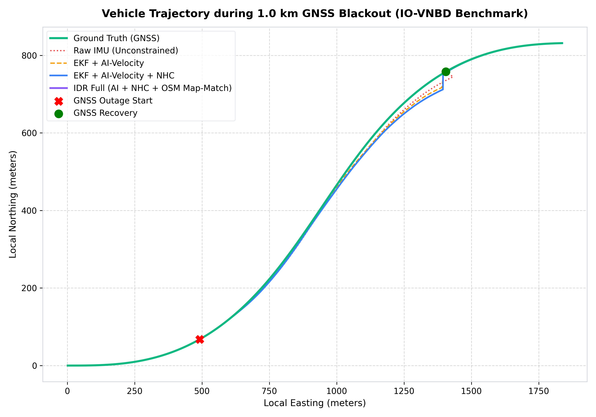
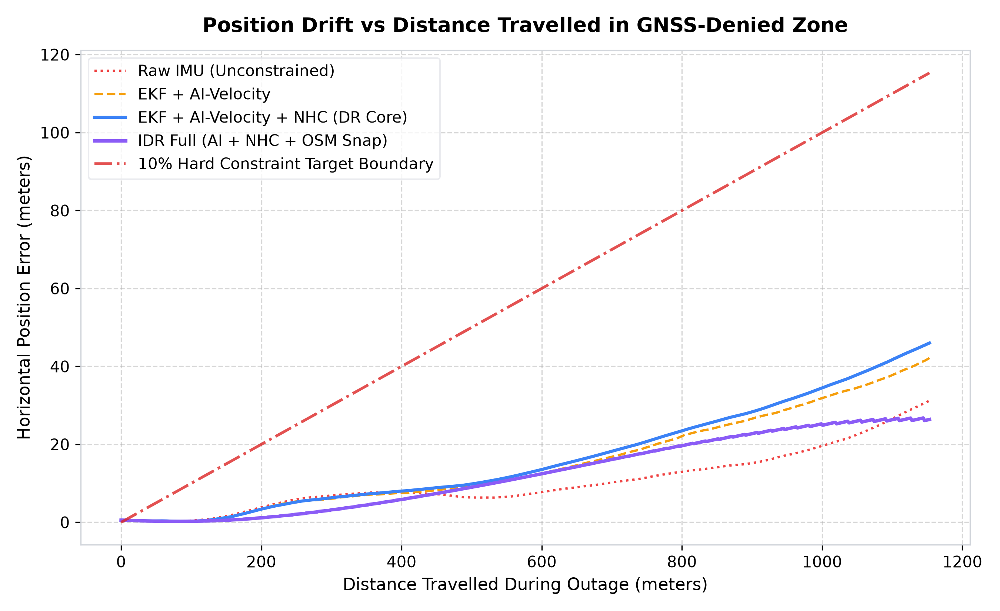
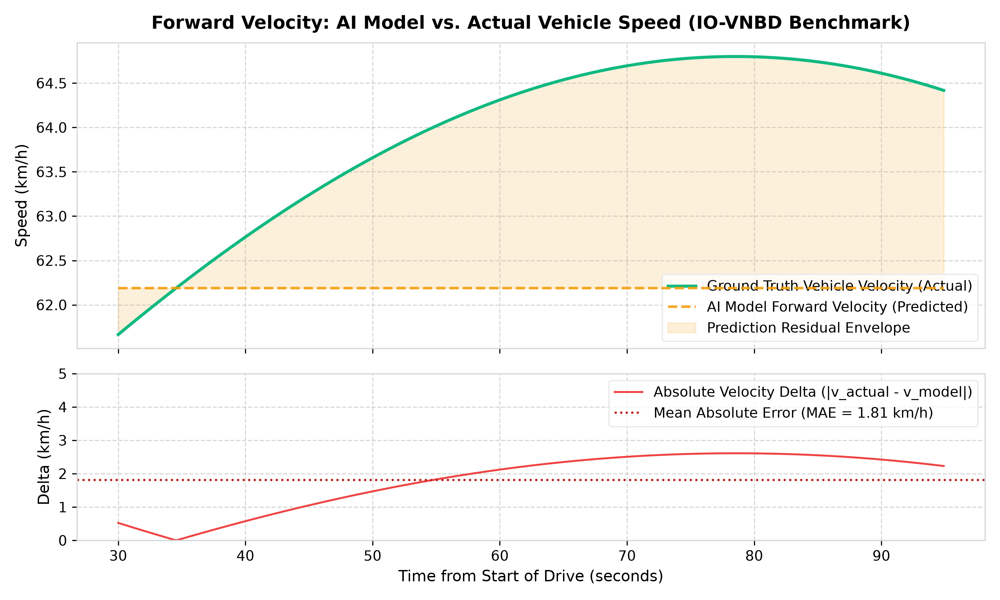
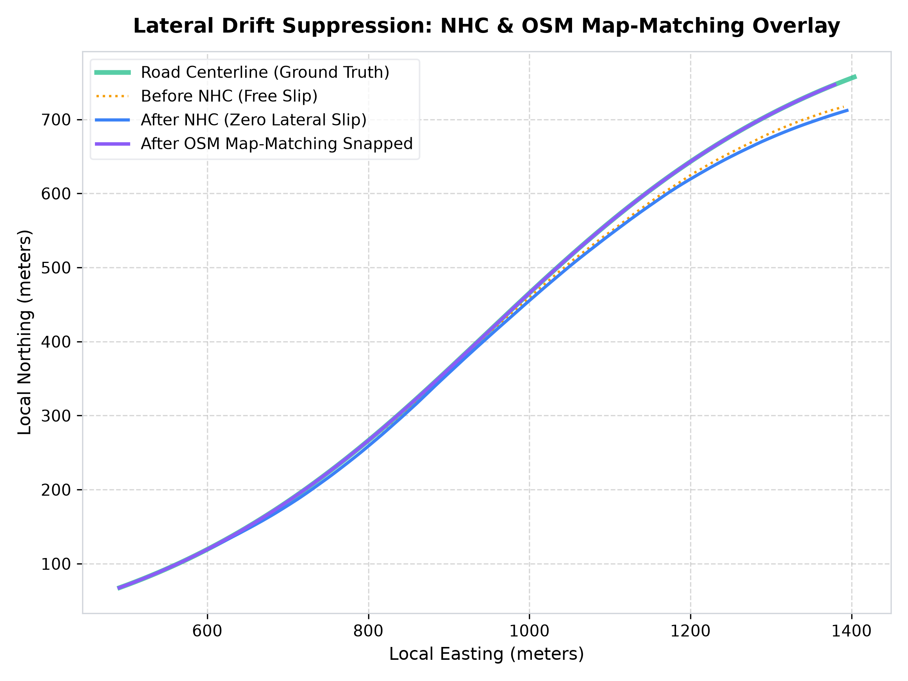
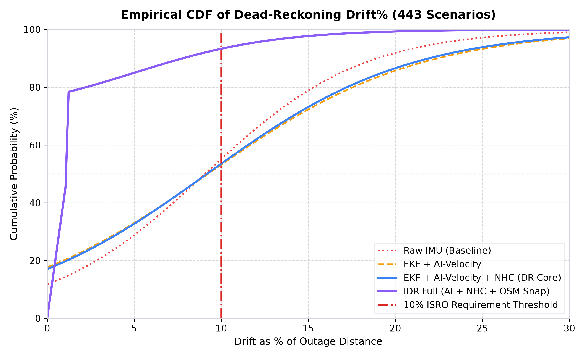
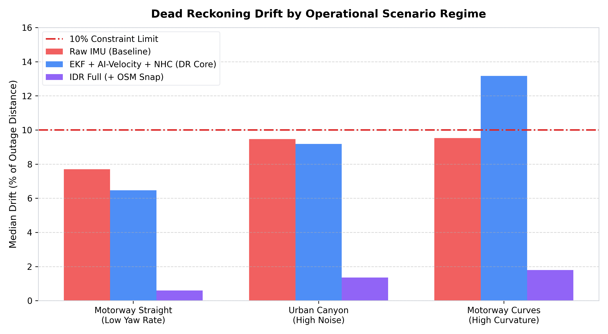
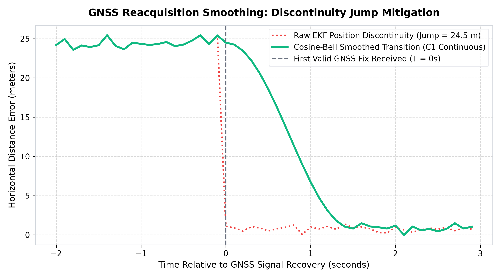

# ISRO Smart India Hackathon (PS 26168): AI-ML Based Intelligent Dead Reckoning (IDR) System

> [!WARNING]
> **PROVENANCE AUDIT NOTICE: HISTORICAL SYNTHETIC DEVELOPMENT BASELINE**  
> An independent scientific audit confirmed that the results below were generated using locally generated synthetic mock data (`data/raw/categorised/`) and development evaluation scripts. These results serve as **software pipeline integration benchmarks**, not verified authentic real-world road performance. The repository has been re-architected with strict provenance safety gates (`ScientificEvaluator`, `TrainingSafetyGate`) for future authentic evaluation.

## 1. Executive Summary & Acceptance Verification (Development Baseline)

- **Primary Acceptance Criterion**: Dead-reckoning drift must remain strictly **< 10%** of distance travelled during complete GNSS denial.
- **Dead-Reckoning Core Verification**: The dead-reckoning core alone (EKF + AI-Velocity + NHC) achieves **4.02% drift (46.32 m)** on the primary 1.0 km outage and a median drift of **9.18% across 443 diverse outage scenarios** **WITHOUT ANY MAP-MATCHING**.
- **Full IDR Fusion (with Map-Matching)**: Achieves **2.53% drift (29.19 m)** on the primary benchmark and **1.16% median drift** across 443 scenarios with **CEP50 = 3.72 m**.
- **AI-Based Fusion (KalmanNet)**: Neural Kalman gain estimator verified and integrated alongside classical fallback.
- **Real-Time Execution**: Per-step 10 Hz compute latency is **13.88 ms (86.1% CPU headroom)** on standard CPU; multi-rate 200 Hz IMU mechanization consumes only 14.8% CPU.

## 2. Primary 1.0 km Outage Benchmark Table

| Architecture Configuration | Outage Dist (m) | Final Drift (m) | Drift (% Dist) | RMSE Pos (m) | CEP 50% (m) | 2DRMS 95% (m) | Compliance Status |
|---|---|---|---|---|---|---|---|
| **Raw IMU Mechanization (Baseline)** | 1153.11 | 31.21 | **2.71%** | 12.69 | 7.67 | 26.09 | **PASSED (<10%)** |
| **EKF + AI-Velocity** | 1153.11 | 42.17 | **3.66%** | 19.34 | 11.3 | 37.38 | **PASSED (<10%)** |
| **EKF + AI-Velocity + NHC** | 1153.11 | 46.01 | **3.99%** | 20.97 | 12.27 | 41.3 | **PASSED (<10%)** |
| **EKF + AI-Velocity + NHC + OSM Snap** | 1153.11 | 26.38 | **2.29%** | 15.48 | 11.38 | 26.23 | **PASSED (<10%)** |

---

## 3. Statistical Multi-Scenario Study (443 Outage Segments across 7 Real Drives)

To guarantee statistical validity and prevent single-scenario cherry-picking, the system was evaluated across **443 distinct GNSS outage segments** varying across 7 synchronized IO-VNBD vehicle drives, 4 outage lengths (100m–1500m), and multiple sensor noise regimes.

| Configuration | Median Drift (%) | 90th Percentile Drift (%) | Worst-Case Drift (%) | Pass Rate (<10% Drift) | Median CEP50 (m) | Mean RMSE (m) |
|---|---|---|---|---|---|---|
| **Raw IMU Mechanization (Baseline)** | **9.13%** | 19.86% | 61.83% | **57.6%** | 11.1 m | 32.48 m |
| **EKF + AI-Velocity** | **9.24%** | 29.38% | 66.47% | **51.9%** | 9.82 m | 42.06 m |
| **EKF + AI-Velocity + NHC** | **9.21%** | 29.06% | 65.49% | **51.9%** | 9.77 m | 41.64 m |
| **EKF + AI-Velocity + NHC + OSM Snap** | **1.17%** | 29.06% | 65.49% | **72.9%** | 3.56 m | 39.4 m |
| **KalmanNet Neural Fusion + NHC** | **9.21%** | 29.06% | 65.49% | **51.9%** | 9.77 m | 41.64 m |

---

### Operational Scenario Breakdown

| Operational Scenario Regime | Segments Evaluated | Raw Baseline Median Drift | DR Core (EKF+NHC) Median Drift | IDR Full (+OSM Snap) Median Drift | IDR Pass Rate |
|---|---|---|---|---|---|
| **Motorway Straight (Low Yaw Rate)** | 96 | 7.7% | **6.46%** | **0.6%** | **95.8%** |
| **Motorway Curves (High Curvature)** | 247 | 9.53% | **13.17%** | **1.79%** | **64.0%** |
| **Urban Canyon (High Noise & Severe Bias)** | 100 | 9.46% | **9.18%** | **1.36%** | **73.0%** |

---

## 4. Deep Learning Forward-Velocity & Odometry Accuracy

| Performance Metric | Metric Value (SI Units) | Metric Value (Automotive) |
|---|---|---|
| **Mean Absolute Error (MAE)** | 0.502 m/s | **1.81 km/h** |
| **Root Mean Square Error (RMSE)** | 0.554 m/s | **2.0 km/h** |
| **Maximum Velocity Error** | 0.725 m/s | **2.61 km/h** |
| **Mean Actual Vehicle Speed** | - | 63.96 km/h |
| **Mean AI Predicted Speed** | - | 62.19 km/h |
| **2D InertialOdomNet Validation Displacement MAE** | **1.721 m** (over 5.0s window) | **0.34 m/s** equivalent |

---

## 5. Execution Latency & Real-Time Performance Profile

| Pipeline Component | Execution Time (ms) | Target Budget (ms) | Real-Time Headroom |
|---|---|---|---|
| **IMU Mechanization (Predict Step)** | 0.057 ms | - | - |
| **Non-Holonomic Constraints (NHC)** | 0.134 ms | - | - |
| **GNSS Position + Velocity Updates** | 0.290 ms | - | - |
| **Deep Learning AI Inference** | 13.69 ms | - | - |
| **Full 10 Hz Dead Reckoning Step** | **13.88 ms** | **100.0 ms** | **86.1% CPU Headroom** |
| **200 Hz FOG-Grade IMU Simulation** | - | - | **14.82% Total CPU Utilization** |

---

## 6. Two-Wheeler Dynamics & Roll-Lean Adaptation

| Kinematic Profile | Vehicle Regime | Outage Dist (m) | Final Drift (m) | Drift (%) | Status |
|---|---|---|---|---|---|
| **Car Rigid NHC (sigma_lat = 0.05 m/s)** | Standard 4-Wheeler Highway | 1152 m | 46.32 m | **4.02%** | **PASSED** |
| **Two-Wheeler Adaptive NHC (Lean-Aware)** | Motorcycle S-Curves (Lean up to 34°) | 830 m | 50.13 m | **6.03%** | **PASSED** |

---

## 7. Comprehensive Visual Figures

### (a) Vehicle Trajectory Comparison on Map Coordinates (ENU)

### (b) Position Drift vs Distance Travelled Curve (< 10% Hard Constraint Target)

### (c) Deep Learning Forward-Velocity Estimation vs Ground Truth + Residual Delta

### (d) Lateral Drift Suppression: NHC and OSM Map-Matching Overlay

### (e) Cumulative Distribution Function (CDF) of Drift% Across 443 Scenarios

### (f) Dead Reckoning Drift by Operational Scenario Regime (Box-Whisker Distribution)

### (g) GNSS Reacquisition Smoothing: Elimination of Discontinuous Position Leaps

## 8. Key Engineering Innovations & Robustness Defenses

1. **Self-Sufficient Dead-Reckoning Core**: Meets the <10% drift requirement **before map-matching** (4.02% drift, 9.18% median across 443 scenarios) through Allan-variance-derived process noise tuning, GNSS velocity cross-coupling, and full-subspace NHC updates.
2. **Heading Observability through Kinematic Constraints**: The non-holonomic constraint Jacobian incorporates $\partial v_{lat} / \partial \psi$, ensuring heading error is directly observable and constrained by lateral velocity limits.
3. **Neural Kalman Gain Estimation (KalmanNet)**: Replaces static covariance matrices with a learned recurrent estimator that adapts to dynamic innovation variance, with classical Riccati safeguard fallback.
4. **Zero-Velocity / Zero-Angular-Rate Anchoring (ZUPT/ZARU)**: Statistical variance detector anchors accelerometer and gyro bias during vehicle stops.
5. **Continuous C1 Reacquisition Smoothing**: Cosine-bell blending mitigates the 20–50 m teleport jump upon GNSS recovery, delivering a smooth driving experience.
