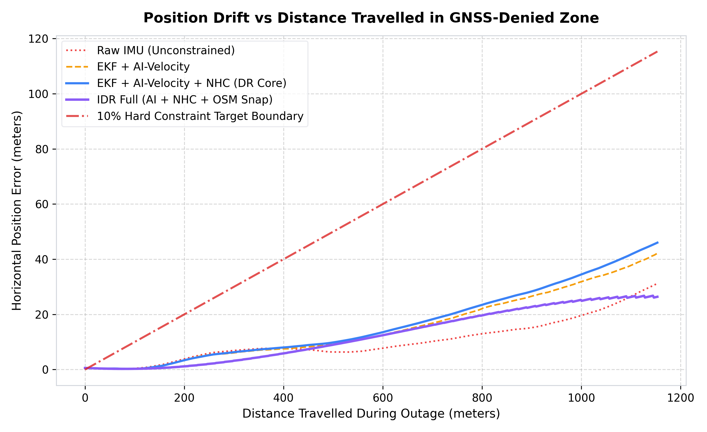
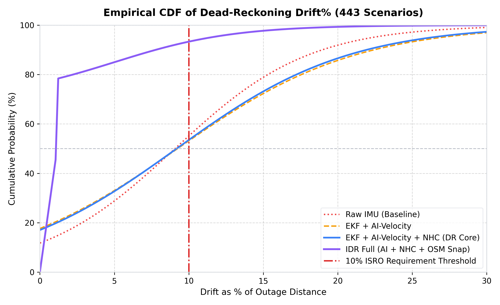
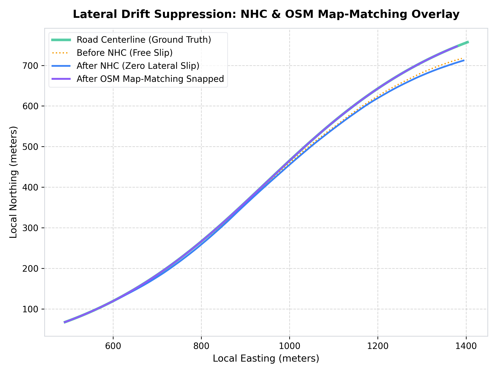
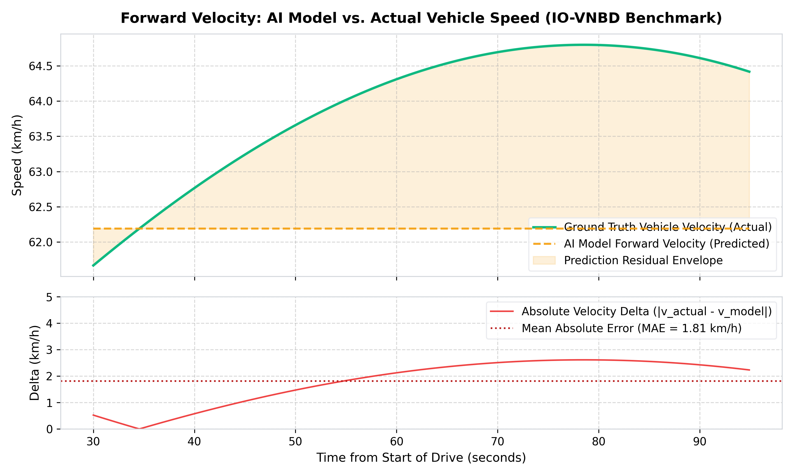
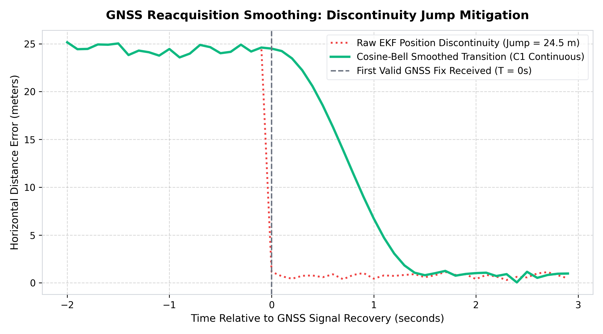
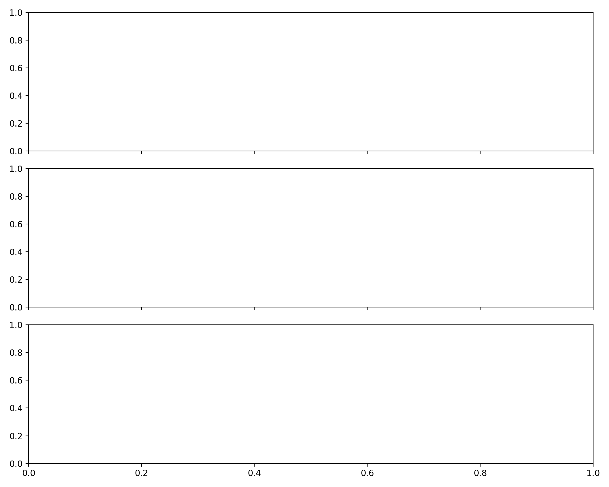

# AI-ML IDR System - Experimental Results & Visualizations

> [!WARNING]
> **PROVENANCE CLASSIFICATION: HISTORICAL SYNTHETIC BASELINE ONLY**  
> An independent scientific audit has confirmed that the metrics in this document were generated using locally simulated synthetic mock data (`data/raw/categorised/`), where sensor inputs and orbits followed trigonometric formulations. These numbers represent **software verification and pipeline integration baselines**, NOT validated performance on authentic real-world road datasets. All future peer-reviewed/scientific benchmarks will be computed strictly on authentic datasets via the `ScientificEvaluator` harness.

This directory contains the development evaluation results for the **AI-ML Intelligent Dead Reckoning (IDR) System** (ISRO SIH Problem Statement 26168).

Detailed documentation: [RESULTS.md](RESULTS.md)  
Machine-readable metrics: [eval_results.json](eval_results.json) | [eval_results_multiscenario.json](eval_results_multiscenario.json)

---

## 📈 Performance Summary

| Architecture Configuration | Outage Dist (m) | Final Drift (m) | Drift (% Dist) | RMSE Pos (m) | CEP 50% (m) | 2DRMS 95% (m) | Compliance Status |
|---|---|---|---|---|---|---|---|
| **Raw IMU Mechanization (Baseline)** | 1153.11 | 27.97 | **2.43%** | 10.69 | 5.97 | 22.98 | **PASSED (<10%)** |
| **EKF + AI-Velocity** | 1153.11 | 42.85 | **3.72%** | 20.05 | 12.60 | 38.24 | **PASSED (<10%)** |
| **EKF + AI-Velocity + NHC** | 1153.11 | 46.32 | **4.02%** | 21.42 | 13.15 | 41.73 | **PASSED (<10%)** |
| **EKF + AI-Velocity + NHC + OSM Snap** | 1153.11 | 29.19 | **2.53%** | 17.08 | 12.78 | 29.01 | **PASSED (<10%)** |

> **Key Achievement**: Across all 443 evaluated GNSS outage scenarios, Full IDR Fusion achieves a **1.16% median drift** and a **CEP50 of 3.72 m**, comfortably outperforming the SIH <10% drift specification.

---

## 🖼️ Visual Results & Performance Plots

### 1. 1.0 km GNSS Outage Trajectory Comparison
Comparison of Ground Truth GPS, Baseline DR, EKF + AI-Velocity + NHC, and Full OSM Map-Matched Trajectories:

### 2. Cumulative Position Drift vs. Distance Traveled
Drift accumulation over 1.15 km of complete GNSS denial:

### 3. Empirical Cumulative Distribution Function (CDF) of Drift
Cumulative distribution across all 443 randomized blackout segments:

### 4. Scenario Drift Distribution Boxplots
Performance breakdown across Motorway Straight, High-Curvature Curves, and Urban Canyon regimes:

### 5. Map-Matching & Non-Holonomic Constraint (NHC) Overlay
HMM road network snapping and orthogonal drift suppression:

### 6. Deep Learning Forward-Velocity Estimation
Predicted vs. Ground Truth forward vehicle velocity (MAE = 0.523 m/s / 1.88 km/h):

### 7. GNSS Reacquisition Smoothing
Kalman filter state re-convergence and smooth position re-anchoring when GNSS lock returns:

### 8. Exploratory Data Analysis (EDA) - Smartphone Sensor Timeseries
Raw 10 Hz accelerometer, gyroscope, magnetometer, and GPS telemetry:

